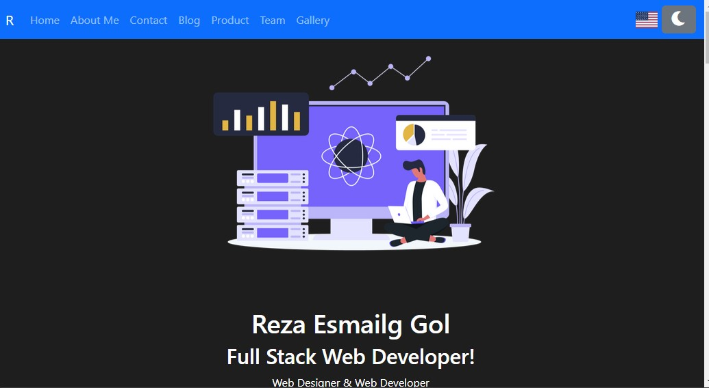
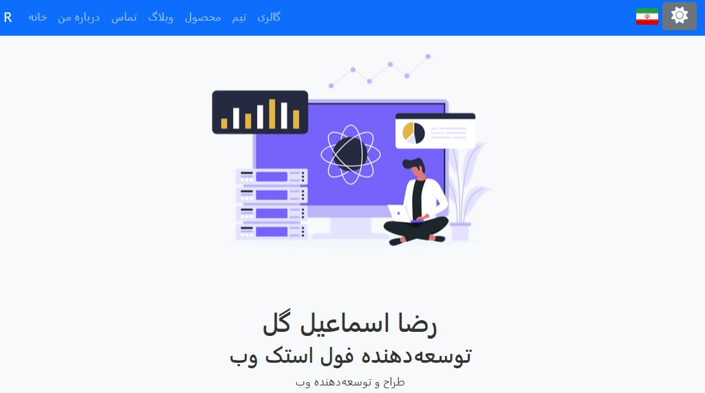
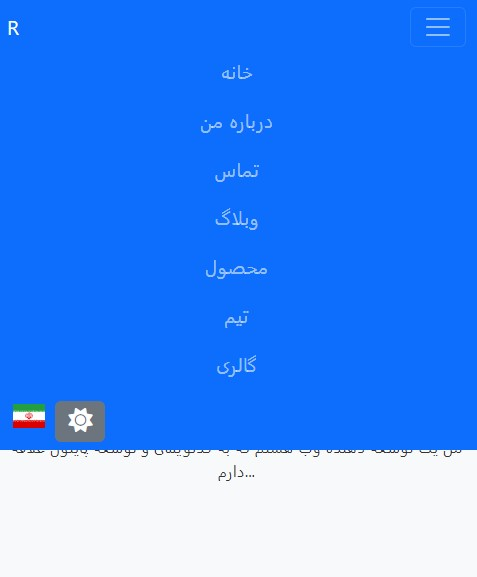

Dynamic Multi-Language Portfolio with Dark Mode & Smooth Scrolling

English Description
About This Project
This project is a dynamic, multi-language portfolio website designed for developers, freelancers, or anyone wanting to showcase their work. It includes multi-language support (English and Persian), dark mode, smooth section transitions, and auto-saving of settings like the last viewed section and chosen language. Built with HTML, CSS, JavaScript, and JSON, the website offers a clean, modern user experience.

Key Features
Dark Mode: Toggle between light and dark themes. The user's preference is saved for future visits.
Multi-Language Support: Users can switch between English and Persian using a flag toggle, powered by JSON translations.
Smooth Scrolling Navigation: Users can scroll smoothly or use arrow keys to navigate between sections.
Responsive Design: The website is fully responsive and optimized for both desktop and mobile devices.
Save Preferences: The last viewed section and theme preferences are saved in the browser's local storage.
How to Use
Clone the repository.
Run the website locally on a development server.
Modify translations in the languages.json file.

Persian Description (توضیحات فارسی)
درباره این پروژه
این پروژه یک وبسایت نمونه کار پویا و چندزبانه است که برای توسعه‌دهندگان و فریلنسرها طراحی شده است. این وبسایت شامل پشتیبانی چندزبانه (انگلیسی و فارسی)، حالت دارک مود، انتقال نرم بین بخش‌ها و ذخیره خودکار تنظیمات است. با استفاده از HTML، CSS، جاوااسکریپت و JSON ساخته شده و تجربه کاربری مدرنی را ارائه می‌دهد.

ویژگی‌های کلیدی
حالت دارک مود: کاربر می‌تواند بین حالت‌های روشن و تاریک جابجا شود و تنظیمات در مراجعه‌های بعدی به یاد آورده می‌شوند.
پشتیبانی از چند زبان: کاربر می‌تواند با استفاده از دکمه پرچم، بین زبان‌های فارسی و انگلیسی جابجا شود.
ناوبری نرم بین بخش‌ها: کاربران می‌توانند به راحتی بین بخش‌های مختلف اسکرول کرده و جابجا شوند.
طراحی واکنش‌گرا: این وبسایت برای تمامی دستگاه‌ها بهینه شده و در صفحه‌های موبایل و دسکتاپ به زیبایی نمایش داده می‌شود.
ذخیره تنظیمات: آخرین بخش مشاهده‌شده و تنظیمات زبان در حافظه مرورگر ذخیره می‌شوند.

Technologies Used:
HTML5, CSS3, JavaScript (Vanilla)
FontAwesome for icons
JSON for translations
Local Storage for saving preferences
Screenshots:
